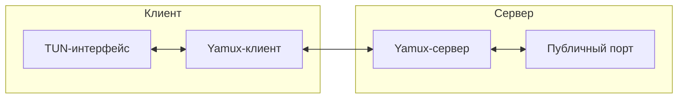

# nat-tunnel-2024 🌐

[](https://github.com/Shiro-nn/nat-tunnel-2024/stargazers)
[](https://github.com/Shiro-nn/nat-tunnel-2024/network/members)
[](https://github.com/Shiro-nn/nat-tunnel-2024/issues)
[](https://github.com/Shiro-nn/nat-tunnel-2024/commits)
[](LICENSE)
[](https://github.com/Shiro-nn/nat-tunnel-2024)


> **nat-tunnel-2024** — это проект, реализующий NAT-туннель на языке программирования Rust. Проект был разработан в 2024 году и переведён в **архивный режим**. Код остаётся в открытом доступе «как есть» — без гарантий поддержки и новых релизов. Использовать не рекомендуется, только для референсов.

---

## 📂 Состав репозитория

| Директория  | Язык/стек                                          | Краткое описание                                                                                                              |
| ----------- | -------------------------------------------------- | ----------------------------------------------------------------------------------------------------------------------------- |
| **`src`**   | **Rust** (`tokio`, `yamux`, `tun`, `clap`)         | Содержит исходный код клиента (`client.rs`) и сервера (`server.rs`), реализующих NAT-туннель с использованием Yamux для мультиплексирования. |

> **Важно:** Клиент и сервер запускаются **независимо** и не связаны единой оркестрацией — каждый имеет собственный бинарник, определённый в `Cargo.toml`.

---

## 🚀 Быстрый старт (локально)

### Клиент (`nat-tunnel-client`)

```bash
git clone https://github.com/Shiro-nn/nat-tunnel-2024.git
cd nat-tunnel-2024
cargo build --release
sudo ./target/release/nat-tunnel-client --server <server_ip:port> --vip <virtual_ip> --mtu <mtu>
```

- `<server_ip:port>` — адрес и порт сервера (например, `127.0.0.1:7000`).
- `<virtual_ip>` — виртуальный IP для TUN-интерфейса (например, `10.2.0.2`).
- `<mtu>` — MTU для TUN-интерфейса (по умолчанию `1400`).

**Примечание:** Для работы TUN-интерфейса могут потребоваться права суперпользователя.

### Сервер (`nat-tunnel-server`)

```bash
cargo build --release
./target/release/nat-tunnel-server --bind <bind_address> --public-port <public_port>
```

- `<bind_address>` — адрес и порт для прослушивания клиентских подключений (по умолчанию `0.0.0.0:7000`).
- `<public_port>` — порт, который будет открыт для входящих соединений (по умолчанию `8080`).

---

## 🧩 Архитектура

Проект состоит из двух основных компонентов:

- **Клиент** (`nat-tunnel-client`): Создаёт TUN-интерфейс и устанавливает соединение с сервером через Yamux. Пересылает пакеты из TUN на сервер и обратно.
- **Сервер** (`nat-tunnel-server`): Принимает подключения от клиентов и входящие соединения с публичного порта. Пересылает трафик между публичными соединениями и Yamux-сессиями клиентов.



---

## 🛠️ Системные требования

- **Rust 1.75+** и `cargo` для сборки и запуска.
- **Зависимости**: `anyhow`, `bytes`, `clap`, `log`, `env_logger`, `tokio`, `tun`, `yamux`.
- **Права суперпользователя** для создания TUN-интерфейса на клиенте.

---

## 🤝 Вклад

Репозиторий **архивирован**. Для развития идей — форкайте и экспериментируйте.

---

## ⚖️ Лицензия

Код распространяется под лицензией **MIT**. Используйте свободно, но без каких-либо гарантий.

> Спасибо за интерес! Надеюсь, примеры кода окажутся полезными в ваших проектах.
